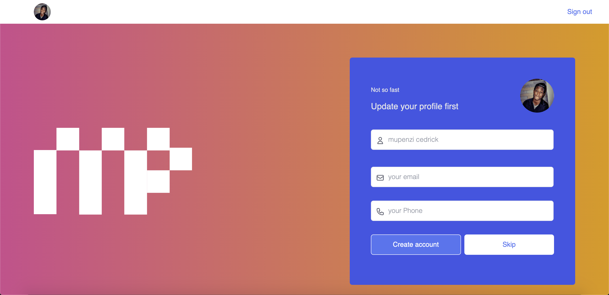

# Minority-Front-end (NEXTjs)

```
Preview Design of Minority (preview)
```



## hosted version of the application

If you want to have a look on the hosted version of the app click **[HERE](https://minority-frontend.vercel.app/)**


# Installation and Environment Setup ⚙︎ 

**Clone the repository from [Github](https://github.com/pextech/Resume-React.git).**

( You will need **Git** for this if you are running a Windows PC, Get it [HERE](https://git-scm.com/) )

```
git clone https://github.com/pextech/Resume-React.git
```

**To Install all dependencies:** 🔧

```
npm install
```


**Now to run the app:**

```
npm run dev
```


# Tools used

- NEXTjs **javascript UI library**
- Tailwind: **css**

# More Tools

- ES6 Transpiler: **[Babel](babeljs.io)**
- Deployment: **[Heroku](https://www.heroku.com)** and **[vercel](https://www.vercel.com/)**

- Deployment : **Vercel**
- link to the app: **[link](https://minority-frontend.vercel.app/)**

# Contribute

If you ever have an idea on how you might help improve the app, you are welcome to contribute your changes to the repository, Just follow the steps below:

Assumming you have the repo cloned on your PC,

- Pull the latest changes from the remote repo by running:

```
git pull origin main
```

NB: You need to be on the develop branch when you do this

- Create & switch to the new branch where you will add your changes by running:

```
git checkout -b `yournewbranchname`
```

- After adding your changes, commit and push them to create a pull request against the develop branch. I will review and merge them if they are helpful.


# Author 

` Pextech 😎🇷🇼 `

